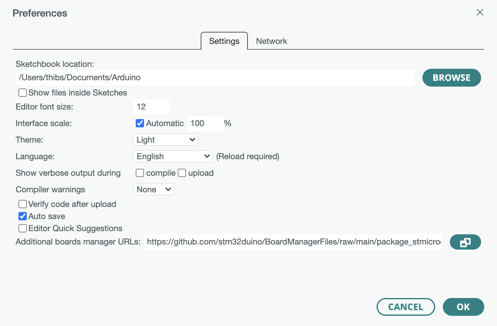
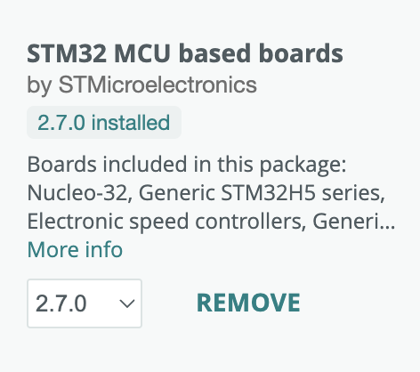
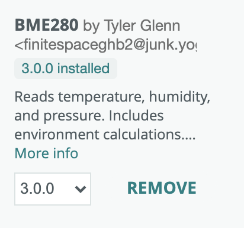
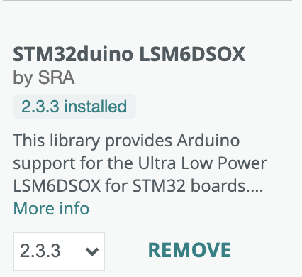
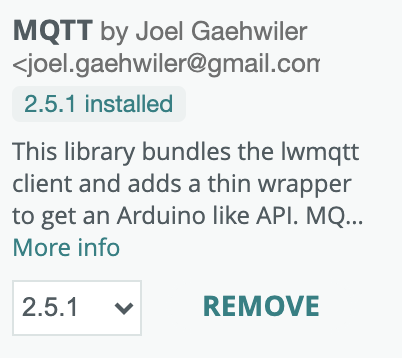

# IoT Continuum

This page is part of the [IoT Continuum Dev Kit](/)

<picture>
 <source media="(prefers-color-scheme: dark)" srcset="../images/DevKit_face1-black.jpg">
 <source media="(prefers-color-scheme: light)" srcset="../images/DevKit_face1-white.jpg">
 
</picture>


# Getting Started (Arduino IDE)

To run this getting started tutorial, you need the following hardware:
* 1 IoT Continuum Dev Kit
* 1 ST-LINK V3 Programmer (J-TAG)
* 1 Orange SIM card already activated and inserted in the SIM holder

## Arduino Environment Setup

This development environment is compatible with Windows, Mac & Linux.
If the Arduino IDE environment is not installed yet, install the latest version from [Arduino website](https://www.arduino.cc/en/software) -- would you encounter any issue with the latest version, note that we have succesfully tested the following versions: `1.8.19`, `2.1.1`, `2.2.1`

## Add support for STM32 in Arduino IDE

1. In the Arduino IDE, open the "Preferences" menu and add `https://github.com/stm32duino/BoardManagerFiles/raw/main/package_stmicroelectronics_index.json` to the "Additional boards manager URLs". Note: you may need to configure a proxy in the network tab to access Internet if you get a connection error at this point.



2. In the "Tools" menu, select "Board" > "Boards Manager" submenu. Search for "STM32" using the search field at the top and click on ""STM32 by STMicroelectronics". Install the version `2.7.0`



## Select the STM32 hardware in Arduino IDE

For each new project opened in the Arduino IDE, you must select the board to use for compiling, and select the port the board is connected to to upload the program:
1. Make sure the board and the ST-LINK programmer are both connected to your computer with each a USB cable (use data cables, not power-only usb cables)
2. In the Arduino IDE, open the menu "Tools"
    1. In the submenu "Board" select the `STM32 MCU based board` and then `IoT continuum boards`
    2. In the submenu "Board part number" select `IoT continuum Dev Kit`
    3. Make sure that the “Upload method” is `STM32CubeProgrammer (SWD)`
    4. In the submenu "Port" select the Silicon Labs CP210x USB to UART (depending on your PC it may appear as "SLAB USB to UART"). If no such port appears, you may want to check that the USB port is showing up: look for "Silicon Labs CP210x USB to UART Bridge"
        * on Windows: open the Device Manager and look up in the "Port (COM & LPT)" section
        * on Mac and Linux: open a terminal and run `lsusb -v` command.
        * If it does not show up, install the driver from [here](https://www.silabs.com/developers/usb-to-uart-bridge-vcp-drivers?tab=downloads) and try again.
    5. Open the Serial Monitor and make sure the configuration is `115200 bauds`, `No Line Ending`

## Compile & Upload a first code

1. Unless STM32Cube environment is already installed on your development machine, you'll need to download the STM32CubeProgrammer first. Download it and install it from [here](https://www.st.com/en/development-tools/stm32cubeprog.html) using the default options -- Note: on MacOS, if the installer execution does nothing (bug), run it from the terminal with the command `./SetupSTM32CubeProgrammer-2.14.0.app/Contents/MacOs/SetupSTM32CubeProgrammer-2_14_0_macos` (the name of the file may change with a newer version)

3. With an empty project or using the [HelloWorld code sample](examples/HelloWorld), use the right arrow button in the Arduino IDE to compile and upload your program into the IoTContinuum Dev Kit.


You should get the following output:
```
-------------------------------------------------------------------
STM32CubeProgrammer v2.14.0
-------------------------------------------------------------------
ST-LINK SN : 001800363137511133333639 ST-LINK FW : V3J11M3
Board : STLINK-V3MINI
Voltage : 3.25V
SWD freq : 8000 KHz
Connect mode: Under Reset
Reset mode : Hardware reset
Device ID : 0x482
Revision ID : Rev X
Device name : STM32U575/STM32U585 Flash size : 2 MBytes
Device type : MCU
Device CPU : Cortex-M33
BL Version : 0x92
Debug in Low Power mode enabled
-------------------------------------------------------------------
Choose flashing speed for Cortex M33 series.(default speed=Reliable)
-------------------------------------------------------------------
Memory Programming ...
Opening and parsing file: Test_devkit.ino.bin
File
Size Address
: HelloWorld.ino.bin : 39.65 KB
: 0x08000000
Erasing memory corresponding to segment 0:
Erasing internal memory sectors [0 4] Download in Progress:
File download complete
Time elapsed during download operation: 00:00:00.425 RUNNING Program ...
Address: : 0x8000000
Application is running, Please Hold on...
Start operation achieved successfully
```

## Adding mandatory libraries to Arduino IDE

The following libraries must be installed in the Arduino IDE:
* The IoTcontinuum devkit library (which includes the following libs: PCA9534 GPIO Expander, HL7812, MQTT):
    1. Download [lib/iotcontinuum_devkit.zip](lib/iotcontinuum_devkit.zip) (sources are available in [src](src/))
    2. Open the menu "Sketch" > "Include Library" > "Add .ZIP Library" and select the .zip file downloaded
* BME280 humidity/pressure/temperature sensor: select and install the BME280 library by Tyler Glenn (3.0.0 or above) from the Arduino IDE library
* LSM6DSOX accelerometer/gyroscope sensor: select and install the LSM6DSOX library by SRA (2.3.3 or above) from the Arduino IDE library
* MQTT: select and install the MQTT library by Joel Gaehwiler (2.5.1 or above) from the Arduino IDE library

 &nbsp;  &nbsp; 

## Code Samples

You are now ready to check out few code samples! We suggest that you start by the following examples:

1. [Hello World](examples/HelloWorld) -- always start with the simplest code possible: let's make a LED blink!
1. [Monitor onboard sensors](examples/Sensors) -- now, let's learn how to read all onboard sensors
1. [Send AT Commands to the HL7812 cellular module](examples/ATCommands_HL7812) -- let's learn how to communicate with the cellular module
1. [Send data to Orange Live Objects using MQTT on LTE-M cellular network](examples/LiveObjects)

If you made it until there, you are now ready to explore more code samples by yourself from the [examples folder](examples) -- Enjoy!

