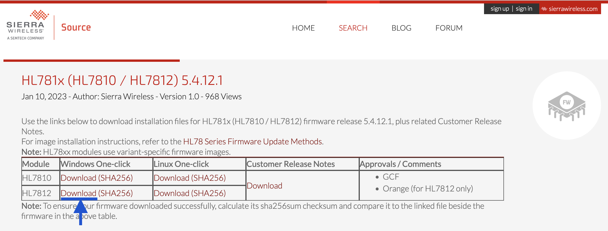

# IoT Continuum

This page is part of the [IoT Continuum Dev Kit](/)

<picture>
 <source media="(prefers-color-scheme: dark)" srcset="images/DevKit_face1-black.jpg">
 <source media="(prefers-color-scheme: light)" srcset="images/DevKit_face1-white.jpg">
 
</picture>

# Firmware Upgrade

This section contains the firmware upgrade procedures for the various components of the development kit.
You may want to ensure your firmware is up to date before proceeding with the Getting Started instructions.

## Sierra Wireless HL7812 module

This devkit has been validated with the HL7812 firmware `5.4.12.1`.
The firmware can be downloaded from [Sierra Wireless Source website](https://source.sierrawireless.com/resources/airprime/software/hl781x-and-hl7845-firmware/hl781x-and-hl7845-firmware-5,-d-,4,-d-,12,-d-,1/#sthash.fwWxnRTe.adE3QaLa.dpbs)

Note: In the following steps we'll detail the procedure for Windows, but Sierra Wireless provides a way to do it on Linux too.

1. Click on "download" as shown below to download the file named `HL7812.5.4.12.1.exe`:



2. Connect the devkit to your Windows PC using a USB data cable.

3. Open the Windows Device Manager, and look for the Silicon Labs CP210x USB to UART showing up in the "Port (COM & LPT)" section. If it does not show up, install the driver from [here](https://www.silabs.com/developers/usb-to-uart-bridge-vcp-drivers?tab=downloads) and try again.

4. Create a `HL78xx_download.ini` in `C:\Users\[...]\AppData\Roaming` directory with the following text (you may need to "display hidden files" in the explorer to see the `AppData` directory within the user directory) :
```
[Download]
Port=
ComBaud=115200
```
*Note*: the Port number must be the one showing up in Windows Device Manager at the previous step.

4. Launch `HL7812.5.4.12.1.exe` and wait for the execution to finish
