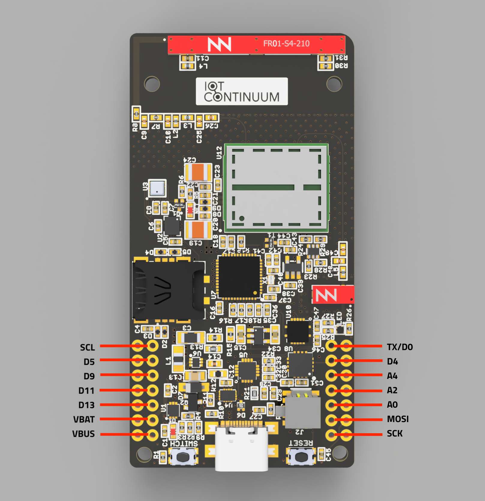

# IoT Continuum Development Kit

<picture>
 <source media="(prefers-color-scheme: dark)" srcset="images/DevKit_face1-black.jpg">
 <source media="(prefers-color-scheme: light)" srcset="images/DevKit_face1-white.jpg">
 
</picture>

## Arduino IDE or STM32 Cube IDE?

2 Getting Started experiences are provided: one using the Arduino IDE (simpler) and the other one using the STM32 Cube IDE (recommended for proper engineering).

If you are discovering this development kit and are not familiar with STM32 Cube environment, we recommend you to [get started with the Arduino IDE](Arduino/README.md). Otherwise, the [STM32 Cube IDE](STM32Cube/) is the recommended way, especially because of its debug capabilities that are not available on Arduino environment.

## Specifications

<picture>
 <source media="(prefers-color-scheme: dark)" srcset="images/DevKit_face1-black-annotated.png">
 <source media="(prefers-color-scheme: light)" srcset="images/DevKit_face1-white-annotated.png">
 
</picture>

|  |  |
| --- | --- |
| **Microcontroller** | STM32U585CIU6 (STM32U5 series)  |
| Architecture | Ultra-low-power ARM Cortex-M33 32bits with FPU, DSP, MPU |
| Flash Memory | 2MBytes |
| SRAM | 786 KB |
| Clock Speed | 160 MHz |
| Compatibility | Arduino, STM32 |
|  |  |
| **Board** size | 72.66 x 38.1 mm |
| Operating Voltage | 3.3V |
| I/O Pins | 24 |
| Analog Output Pin | 12-bit DAC |
| External Interrupts | Available on all pins |
| DC Current per I/O pin | 5 mA |
| Power | 5V USB power and/or 3.7 LiPo battery |
| Charging | Charge controller, up to 500mA charge current with battery meter |
|  |  |
| **Sensors** |  |
| BME280 | Humidity, Pressure, Temperature sensors |
| LSM6DSOX | Accelerometer, Gyroscope |
| LED | RGB LED |
|  |  |
| **Connectivity** |  |
| Cellular Module | Sierra Wireless HL7812 |
| Cellular | LTE-M, 2G |
| Positioning | GNSS |
| USB | USB-C Port |

## Pinout

### Outer PINs

| I/O Pins | Arduino | STM32U585 |
| --- | --- | --- |
| 13 | IO13 | GPIO6 Expander |
| 12 | D12 | PB13 |
| 11 | D11 | PA11 |
| 10 | D10 | PA8 |
| 9 | D9 | PB15 |
| 6 | D6 | PB14 |
| 5 | D5 | PB10 |
| 4 | IO4 | GPIO1 Expander |
| SCL | D17 | PB6 |
| SDA | D18 | PB7 |
| RX/D1 | D1 | PA3 |
| TX/D0 | D0 | PA2 |
| A0 | A0/D2 | PA0 |
| A1 | A1/D3 | PA1 |
| A2 | A2/D4 | PA6 |
| A3 | A3/D7 | PB0 |
| A4 | A4/D8 | PB1 |
| A5 | A5/D13 | PB2 |
| SCK | D14 | PB3 |
| MISO | D15 | PB4 |
| MOSI | D16 | PB5 |

### Inner PINs

| I/O Pins | Arduino | STM32U585 | Comment |
| --- | --- | --- | --- |
| BAT_LEVEL | BAT_LEVEL | PA4 | Battery level |
| USB_UART_RX | PIN_SERIAL_RX | PA5 | RX to USB |
| USB_UART_TX | PIN_SERIAL_TX | PA7 | TX to USB |
| MODULE_TX | PIN_SERIAL3_TX | PA9 | TX to HL7812 |
| MODULE_RX | PIN_SERIAL3_RX | PA10 | RX to HL7812 |
| BUTTON | USER_BTN | PA12 | Push button status |
| SWDIO | NC | PA13 | J-TAG Programming |
| SWCLK | NC | PA14 | J-TAG Programming |
| WAKE_UP | WAKE_UP_HL7812 | PA15 | Module wake up on sleep |
| VGPIO | VGPIO | PC13 | Module state (active/on sleep) |
| SEL_MODE_UART | SWITCH_TO_HL7812 | PB8 | UART mode activation (STM32 or HL7812) |
| RESET MODULE | RESET_HL7812 | PB12 | Module Reset |
| INT2_ACCEL | INT_ACCEL | PB9 | LSM6DSOX interrupt state |
| LED RGB | RED_LED, GREEN_LED, BLUE_LED | NC | Led R=GPIO3, G=GPIO4, B=GPIO5 Expander |

# Development Environments

The IoT Continuum Development Kit is compatible with the following development environments:
* Arduino IDE: [Get started](Arduino/) -- recommended for a quick and easy start up
* STM32Cube IDE: [Get started](STM32Cube/) -- recommended for proper engineering (debug capabilities available)

# Firmware Upgrade

Check out the [Firmware Upgrade](Firmware_upgrade.md) section for upgrading the firmware of the various components of the Development Kit.

# Hardware Schematics

Hardware schematics are provided in [schematics](../schematics).

# License

The content of this repository is provided by Orange SA under the [MIT license](/LICENSE).
