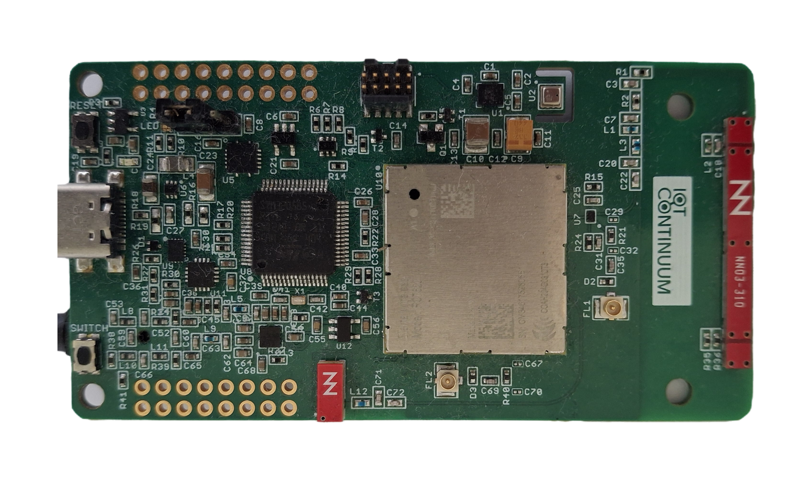
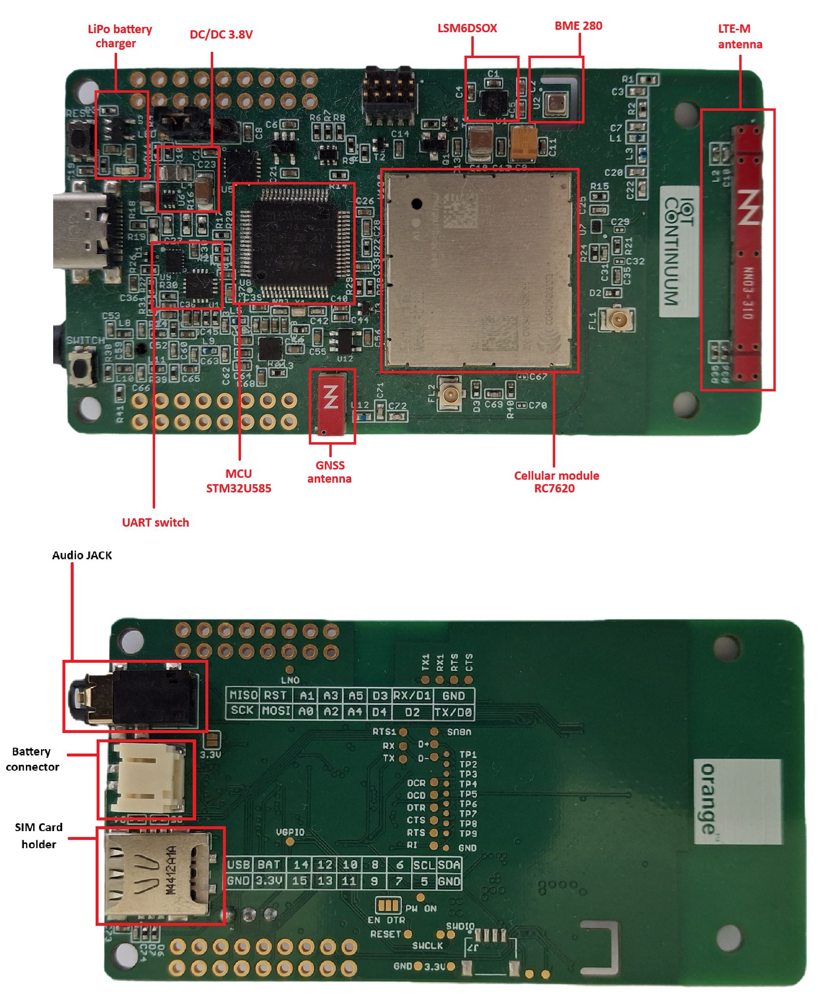
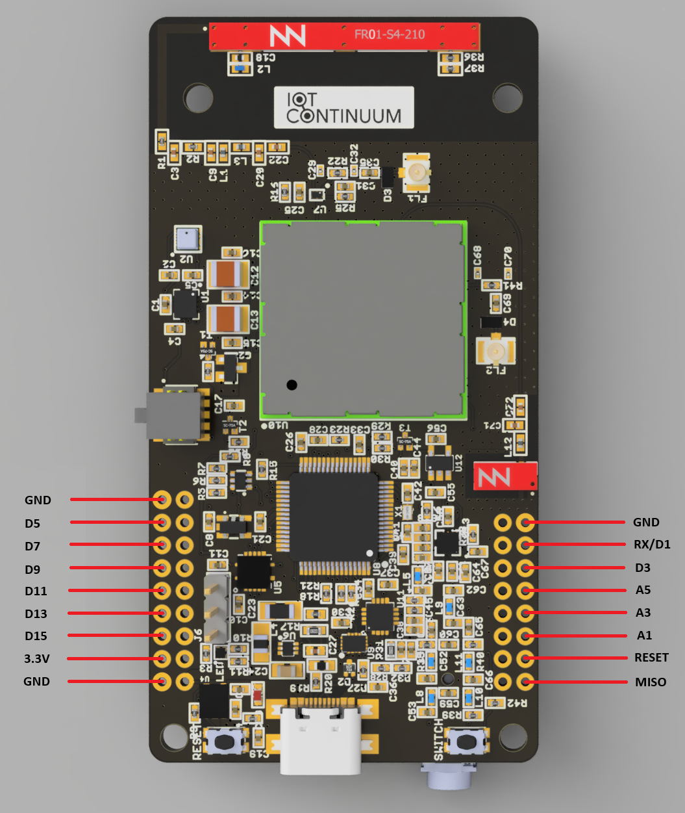
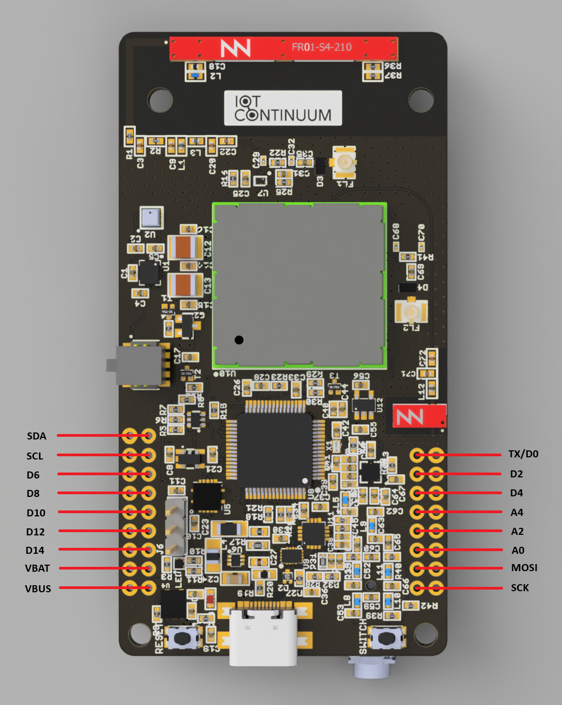

# IoT Continuum Development Kit

<picture>
 <source media="(prefers-color-scheme: dark)" srcset="images/card-top-white.png">
 <source media="(prefers-color-scheme: light)" srcset="images/card-top-black.png">
 
</picture>

## Specifications

<picture>
 <source media="(prefers-color-scheme: dark)" srcset="images/card-legend-tb-white.png">
 <source media="(prefers-color-scheme: light)" srcset="images/card-legend-tb-black.png">
 
</picture>

|  |  |
| --- | --- |
| **Microcontroller** | STM32U585RIT6 (STM32U5 series)  |
| Architecture | Ultra-low-power ARM Cortex-M33 32bits with FPU, DSP, MPU |
| Flash Memory | 2MBytes |
| SRAM | 786 KB |
| Clock Speed | 160 MHz |
| Compatibility | Arduino, STM32 |
|  |  |
| **Board** size | 83.25 x 43.54 mm |
| Operating Voltage | 3.3V |
| I/O Pins | 27 |
| Analog Output Pin | 12-bit DAC |
| External Interrupts | Available on all pins |
| DC Current per I/O pin | 5 mA |
| Power | 5V USB power and/or 3.7 LiPo battery |
| Charging | Charge controller, up to 500mA charge current with battery meter |
|  |  |
| **Sensors** |  |
| BME280 | Humidity, Pressure, Temperature sensors |
| LSM6DSOX | Accelerometer, Gyroscope |
| LED | RGB LED |
|  |  |
| **Connectivity** |  |
| Cellular Module | Semtech RC7620 |
| Cellular | 4G LTE Cat-1 3G and 2G fallback VoLTE compatible |
| Positioning | GNSS |
| USB | USB-C Port |

## Pinout

### Outer PINs

| I/O Pins | Arduino | STM32U585 |
| --- | --- | --- |
| 15 | D15 | PB8 |
| 14 | D14 | PA15 |
| 13 | D13 | PA12 |
| 12 | D12 | PB9 |
| 11 | D11 | PA8 |
| 10 | D10 | P11 |
| 9 | D9 | PB15 |
| 8 | D8 | PB10 |
| 7 | D7 | PB13 |
| 6 | D6| PB14 |
| 5 | D5 | PB12 |
| 4 | D4 | PB2 |
| 3 | D3 | PB1 |
| 2 | D2 | PB0 |
| RX/D1 | D1 | PA3 |
| TX/D0 | D0 |PA2 |
| SCL | D16 | PB6 |
| SDA | D17 | PB7 |
| A0 | A0 | PA0 |
| A1 | A1 | PA1 |
| A2 | A2 | PA4 |
| A3 | A3 | PA5 |
| A4 | A4 | PA6 |
| A5 | A5 | PA7 |
| SCK | D18 | PB3 |
| MISO | D19 | PB4|
| MOSI | D20 | PB5 |

### Inner PINs

| I/O Pins | Arduino | STM32U585 | Comment |
| --- | --- | --- | --- |
| BAT_LEVEL | BAT_LEVEL | PC3 | Battery level |
| USB_UART_RX | PIN_SERIAL_RX | PC11 | RX to USB |
| USB_UART_TX | PIN_SERIAL_TX | PC10 | TX to USB |
| MODULE_TX | PIN_SERIAL3_TX | PA9 | TX to HL7812 |
| MODULE_RX | PIN_SERIAL3_RX | PA10 | RX to HL7812 |
| BUTTON | USER_BTN | PC5 | Push button status |
| SWDIO | NC | PA13 | J-TAG Programming |
| SWCLK | NC | PA14 | J-TAG Programming |
| WAKE_UP | WAKE_UP_HL7812 | PD2 | Module wake up on sleep |
| VGPIO | VGPIO | PC13 | Module state (active/on sleep) |
| SEL_MODE_UART | SWITCH_TO_HL7812 | PC6 | UART mode activation (STM32 or HL7812) |
| RESET MODULE | RESET_HL7812 | PC9 | Module Reset |
| INT2_ACCEL | INT_ACCEL | PH1 | LSM6DSOX interrupt state |
| RF_CTRL | RF_CTRL | PC4 | Switch RF mode internal antenna=Low, uFL=High |
| RING_INDICATOR | RING_INDICATOR | PC8 | Ring indicator |
| POWER_MODULE | POWER_MODULE | PC7 | Power module off=Low, on=High |
| LED RGB | RED_LED | PC0 | Led Red of RGB LED |
| LED RGB | GREEN_LED | PC2 | Green Led of RGB LED |
| LED RGB | BLUE_LED | PC1 | Red Led of RGB LED |

# Development Environments

The IoT Continuum Development Kit is compatible with the following development environments:
* Arduino IDE: [Get started](Arduino/) -- recommended for a quick and easy start up
* STM32Cube IDE: [Get started](STM32Cube/) -- recommended for proper engineering (debug capabilities available)

# Firmware Upgrade

Check out the [Firmware Upgrade](Firmware_upgrade.md) section for upgrading the firmware of the various components of the Development Kit.

# Hardware Schematics

Hardware schematics are provided in [schematics](schematics).

# License

The content of this repository is provided by Orange SA under the [MIT license](/LICENSE).
