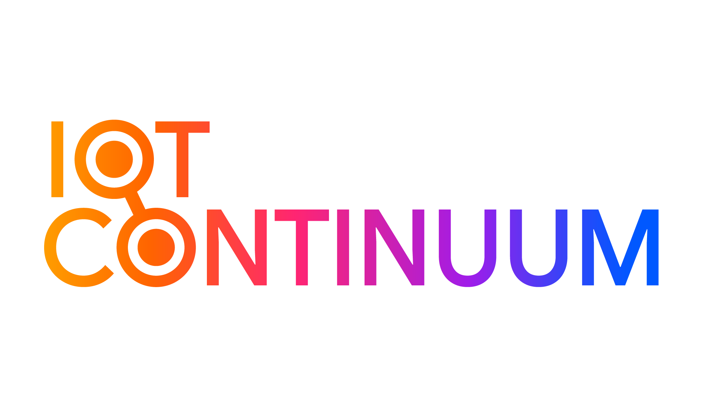

# IoT Continuum Development Kit

<picture>
 <source media="(prefers-color-scheme: dark)" srcset="images/devkit_general-white.png">
 <source media="(prefers-color-scheme: light)" srcset="images/devkit_general-black.png">
 
</picture>

## Why IoT Continuum

With IoT Continuum, gain in efficiency by capitalizing on everything that has been achieved in your project's previous development cycles. Thus, the components and the design used from the start-up phase (PoC – Proof of Concept) are scalable and compatible with the industrial deployment phase. A new design will therefore no longer be necessary either during the next phase of Proof Of Value (convincing) or in the final phase of deployment and industrial scale-up.

There are two models of Development Kit. 

One is based on an HL7812 LTE-M/NB-IoT cellular connectivity module and the next is based on an RC7620 LTE-Cat 1 module. Both of these modules are from SEMTECH.
This development kit is provided by IoT Continuum to developers who are willing to start from scratch with a development kit approved by IoT Continuum.

Read more on [IoT Continuum Website](https://iotjourney.orange.com/fr-FR/iotcontinuum)

## List of available Devkits. 

•	DEVKIT HL7812
All documentation and source code for the HL7812 Devkit are available from the IoT Continuum [HL7812 Devkit link](DevKit-HL7812/README.md).

•	DEVKIT RC7620
For the RC7620-based DevKit, the components are available from the IoT Continuum [RC7620 Devkit link](DevKit-RC7620).

# License

The content of this repository is provided by Orange SA under the [MIT license](/LICENSE).
