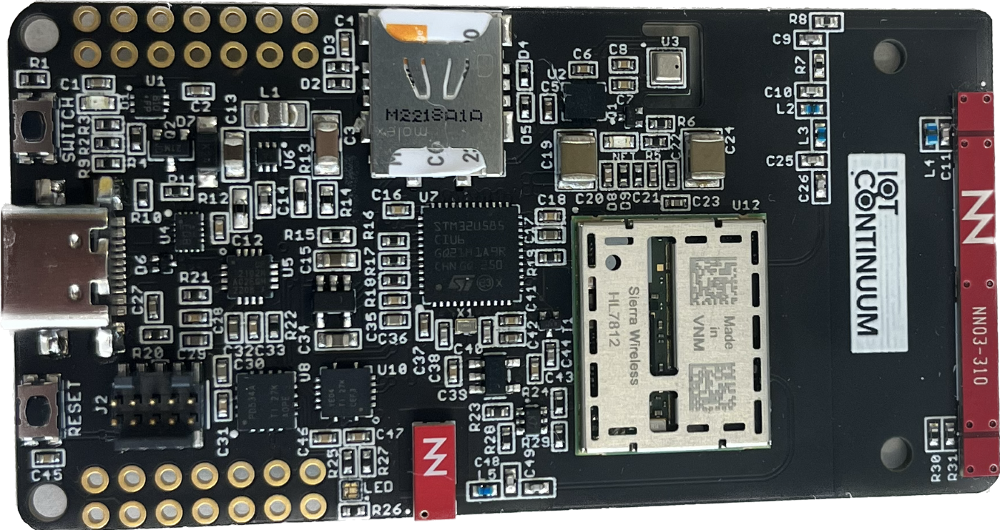

.. _devkit_iotcontinuum_board:

Orange Iot Continuum DevKit
###########################

Overview
********
If you want to develop your own IoT project, you will soon be able to do so with the help of our Continuum IoT development kit
that we are currently finalising. This kit is based on a STMicroelectronics STM32U585 microcontroller, a Sierra Wireless HL7812
connectivity module, a gyroscope, an accelerometer, a temperature sensor, a humidity sensor and a pressure sensor.

   
More information about IoT Continuum can be found at the `IoT Continuum website`_.

Hardware
********
Iot Continuum DevKit provides the following hardware components:

- STM32U585 microcontroller in QFN48 package (2 Mbyte of flash and 786 Kbytes of RAM)
 
- Flexible board power supply:
 
  - USB VBUS or external battery source (3,7/4,2 V Li-Poly battery)
  - Power management access point
 
- A gpio expension device (PCA9534) with three user LEDs:

  - One red LED
  - One green LED
  - One blue LED

- SIM Card support

- One USB/UART Communication module (CP210)

- One UART switch which enable to switch between STM32U585 and HL7812 UART communication
 
- Wireless communication
 
  - LTE-M  (with Sierra HL7812 Modem)
  - GNSS   (with Sierra HL7812 Modem)
  - NB-IoT (with Sierra HL7812 Modem)
  
- Inertial measurement unit (IMU)
   
   - Acceleration (with LSM6DSO module)
   - Rotation (with LSM6DSO module)

- Environmental sensor measurement

   - Temperature (with BME280 module)
   - Pression (with BME280 module)
   - Humidity (with BME280 module)

- Two expension connectors with :

   - Free GPIO to use
   - One SPI free line
   - One COM free line

More information about STM32U585AI can be found here:

- `STM32U585 on www.st.com`_
- `STM32U585 reference manual`_

Supported Features
==================

The STM32U585 microcontroller of the board supports the following hardware features:

+-----------+------------+-------------------------------------+
| Interface | Controller | Driver/Component                    |
+===========+============+=====================================+
| NVIC      | on-chip    | nested vector interrupt controller  |
+-----------+------------+-------------------------------------+
| UART      | on-chip    | serial port-polling;                |
|           |            | serial port-interrupt               |
+-----------+------------+-------------------------------------+
| PINMUX    | on-chip    | pinmux                              |
+-----------+------------+-------------------------------------+
| GPIO      | on-chip    | gpio                                |
+-----------+------------+-------------------------------------+
| RNG       | on-chip    | True Random number generator        |
+-----------+------------+-------------------------------------+
| I2C       | on-chip    | i2c                                 |
+-----------+------------+-------------------------------------+
| SPI       | on-chip    | spi                                 |
+-----------+------------+-------------------------------------+
| DAC       | on-chip    | dac                                 |
+-----------+------------+-------------------------------------+
| ADC       | on-chip    | adc                                 |
+-----------+------------+-------------------------------------+
| WATCHDOG  | on-chip    | independent watchdog                |
+-----------+------------+-------------------------------------+
| USB       | on-chip    | usb_device                          |
+-----------+------------+-------------------------------------+
| BKP SRAM  | on-chip    | Backup SRAM                         |
+-----------+------------+-------------------------------------+
| PWM       | on-chip    | pwm                                 |
| die-temp  | on-chip    | die temperature sensor              |
+-----------+------------+-------------------------------------+
| AES       | on-chip    | crypto                              |
+-----------+------------+-------------------------------------+

The default configuration can be found in the defconfig file:
``boards/arm/devkit_iot_continuum/devkit_iot_continuum_defconfig``

Connections and IOs
===================

DevKit IOT C ontinuum board has 3 GPIO controllers (from A to C). These controllers are responsible for pin muxing, input/output, pull-up, etc.

Each of the GPIO pins can be configured by software as output (push-pull or open-drain), as
input (with or without pull-up or pull-down), or as peripheral alternate function. Most of the
GPIO pins are shared with digital or analog alternate functions. All GPIOs are high current
capable except for analog inputs.

Peripheral Mapping:
----------------------------------

- UART_1 (MODULE) TX/RX   : PA9/PA10 (UART between STM32U585 and HL7812)
- UART_3 (USB_UART) TX/RX : PA7/PA5 
- I2C1 SCL/SDA            : PB6/PB7 
- SPI1 SCK/MISO/MOSI      : PB3/PB4/PB5
- GPIO (SwitchCom)        : PB8 (Enable to switch USB UART output between STM32U585 UART and HL7812 UART)

Serial Port

DevKit IOT Continuum has 2 U(S)ARTs. The Zephyr console output is assigned to USART3. Default settings are 115200 8N1.

For mode details please refer to `STM32 Nucleo-64 board User Manual`_.

Programming and Debugging
*************************

Applications for the ``devkit_iot_continuum`` board configuration can be built and
flashed in the usual way.

Hello world zephyr application example can be build this way:

.. code-block:: bash

   $ west build -b devkit_iot_continuum ../zephyr/samples/hello_world -p 

And for the blinky example:

   .. code-block:: bash

   $ west build -b devkit_iot_continuum ../zephyr/samples/basic/blinky -p 

Flashing
========

Flashing an application to DevKit IOT Continuum board
-----------------------------------------------------

Board is configured to be flashed using west STM32CubeProgrammer runner. Installation of STM32CubeProgrammer is then required to flash the board.

Alternatively, openocd (provided in Zephyr SDK), JLink and pyocd can also be
used to flash and debug the board if west is told to use it as runner,
using ``-r openocd``

Here is an example for the blinky sample zephyr application.

   .. code-block:: bash

   $ west build -b devkit_iot_continuum ../zephyr/samples/basic/blinky -p
   $ west flash 

You will see the LED blinking every second.

Debugging
=========

Default flasher for this board is openocd. It could be used in the usual way (see zephyr documentation)

References
**********

.. target-notes::

.. _IoT Continuum website:
   https://iotjourney.orange.com/en/iotcontinuum

.. _STM32U585 on www.st.com:
   https://www.st.com/en/microcontrollers-microprocessors/stm32u575-585.html

.. _STM32U585 reference manual:
   https://www.st.com/resource/en/reference_manual/rm0456-stm32u575585-armbased-32bit-mcus-stmicroelectronics.pdf

